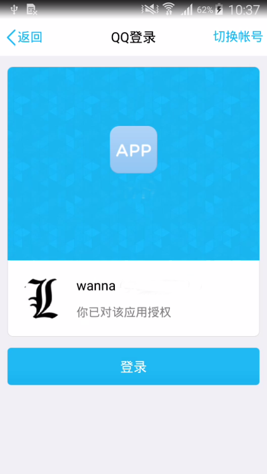

# ShareLoginLib   
[](https://jitpack.io/#tianzhijiexian/ShareLoginLib)  

ShareLoginLib是一个类似于友盟的shareSDK的第三方登录、分享库。这个库可以在保证代码高质量和稳定性的同时，帮助开发者们实现QQ、微博、微信等平台的登录和分享功能。


## 示例
  

## 添加依赖

1.在项目外层的build.gradle中添加JitPack仓库

```
repositories {
  // ...
  maven {
    url "https://jitpack.io"
  }
  maven { url "https://dl.bintray.com/thelasterstar/maven/" }
}
```

2.在用到的项目中添加依赖  

**如果你用的是1.+的版本，即1.3.9之前**

> implementation 'com.github.tianzhijiexian:ShareLoginLib:[Latest release](https://github.com/tianzhijiexian/ShareLoginLib/releases/latest) (<- click it)

> implementation 'com.github.tianzhijiexian:ShareLoginLib:adapter-SNAPSHOT'

如果你用的是1.+的版本，请参考[1.+版本的文档](https://github.com/tianzhijiexian/ShareLoginLib/blob/master/README-VERSION1.%2B.MD)

**如果你用的是2.+的版本（强烈推荐）**

> implementation 'com.github.tianzhijiexian:ShareLoginLib:[Latest release](https://github.com/tianzhijiexian/ShareLoginLib/releases/latest) (<- click it)

3.支持java8语法

```
compileOptions {
  sourceCompatibility JavaVersion.VERSION_1_8
  targetCompatibility JavaVersion.VERSION_1_8 
}
```

## 配置（库版本2.+）

### 1. 在build.gradle中配置QQ的key  

```java
defaultConfig {
    applicationId "xxx.xxx.xxx" // 你的app包名
    
     // tencent+你的AppId
    manifestPlaceholders = ["tencentAuthId": "tencent123456"]
}
```

### 2. 在使用功能前配置常量

这个库允许接入多个平台，库中已经默认实现了QQ、微博、微信的平台代码，如果不能满足你的需求，可以通过实现IPlatform接口来添加新平台。

```java
// 初始该库的基础常量
ShareLoginLib.init(this, getString(R.string.app_name), null, BuildConfig.DEBUG);

// 初始化第三方平台的信息
ShareLoginLib.initPlatforms(
        // map
        MapBuilder.of(
                QQPlatform.KEY_APP_ID, qq_app_id,
                QQPlatform.KEY_SCOPE, qq_scope,

                WeiBoPlatform.KEY_APP_KEY, weibo_app_key,
                WeiBoPlatform.KEY_SCOPE, weibo_scope,
                WeiBoPlatform.KEY_REDIRECT_URL, weibo_redirect_url,

                WeiXinPlatform.KEY_APP_ID, weixin_app_id,
                WeiXinPlatform.KEY_SECRET, weixin_secret
        ),
        // list
        Arrays.asList(
                QQPlatform.class,
                WeiBoPlatform.class,
                WeiXinPlatform.class)
);
```

平台的key和value用Map作为数据结构，支持的平台用list作为数据结构

**下面常量的具体值请和第三方平台进行申请，不要随意填写。**

```java
/**
 * 初始化一些常量，这里的scope请根据第三方的文档进行定制
*/ 
protected void initConstant() {
    qq_app_id = "xxxxxxxxxxxx";
    qq_scope = "get_user_info,"
    + "get_simple_userinfo,"
    + "add_share,"
    + "add_topic,"
    + "add_pic_t";    
    
    weibo_app_key = "xxxxxxxxxxxx";
    weibo_redirect_url = "xxxxxxxxxxxx";
    weibo_scope = "friendships_groups_read,"
    + "friendships_groups_write,"
    + "statuses_to_me_read,"
    + "follow_app_official_microblog";    
    
    weixin_app_id = "xxxxxxxxxxxx";
    weixin_secret = "xxxxxxxxxxxx"; 
}
```

## 使用（库版本2.+）

### 判断是否已安装第三方客户端  

传入平台对应的class即可判断是否安装此平台需要的app，微博可以在不安装时进行登录和分享操作。

```java
ShareLoginLib.isAppInstalled(this, QQPlatform.class);
```

*库考虑的是灵活性，如果觉得传入class不方便，可以在业务角度进行二次封装，产生工具类*

### 登录

登录操作会根据`IPlatform`中定义的常量来区分操作，下面的代码会执行QQ登录（举例）：

```java
ShareLoginLib.doLogin(this, QQPlatform.LOGIN, new LoginListener() {
    @Override
    public void onReceiveUserInfo(@NonNull OAuthUserInfo userInfo) {
        super.onReceiveUserInfo(userInfo);
        // 可以得到：昵称、性别、头像、用户id
    }
});
```

*这里的监听器可以监听到获得token成功、登录失败、取消登录等情况，请根据需要进行实现。*

### 分享

目前分享操作支持分享纯文字，单张图片和富文本网页三种类型，分别对应的类为：

1. ShareContentText
2. ShareContentPic
3. ShareContentWebPage

说明：上述类型都是ShareContent的子类。

执行分享给QQ好友的操作（举例）：

```java
ShareContent shareContent = new ShareContentWebPage("title", "summary", "http://kale.com", bmp); 

ShareLoginLib.doShare(this, QQPlatform.FRIEND, shareContent, new ShareListener(){
    @Override
    public void onSuccess() {
        super.onSuccess();
    }
});
```

*这里的监听器可以监听到用户分享完成、取消分享和分享异常等情况，请根据需要进行实现。*

### 新增平台

本库不仅仅支持上述三者平台，使用者可以灵活增加和替换平台，shareLoginLib仅仅是一个第三方登录分享的框架，只不过提供了QQ等平台的默认实现而已。

如果你需要增加平台，那么可以实现`IPlatform`接口：

```java
public interface IPlatform {

    /**
     * @return 该平台支持的操作类型
     */
    String[] getSupportedTypes();

    /**
     * @return 目标平台的app是否已经安装在手机上
     */
    boolean isAppInstalled(@NonNull Context context);

    /**
     * 检查当前环境，请在当前环境不支持当前操作的type时抛出异常
     *
     * @param type             当前平台支持的操作类型
     * @param shareContentType 分享时传入的分享类型，如果是登录则会传{@link ShareContent#NO_CONTENT}
     */
    void checkEnvironment(Context context, @NonNull String type, @ShareContentType int shareContentType);

    /**
     * 执行登录的操作
     */
    void doLogin(@NonNull Activity activity, @NonNull LoginListener listener);

    /**
     * 执行分享的操作
     */
    void doShare(Activity activity, String shareType, @NonNull ShareContent shareContent, @NonNull ShareListener listener);

    /**
     * 处理第三方sdk响应的结果，会被activity的onActivityResult()间接调用
     */
    void onResponse(@NonNull Activity activity, @Nullable Intent data);

    /**
     * 得到用户的信息，会在{@link LoginListener#onReceiveUserInfo(OAuthUserInfo)}中进行回调
     */
    void getUserInfo(Context context, String accessToken, String uid, final LoginListener listener);

}
```

详细的代码请移步源码中查看QQPlatform来参考，具体的事件处理请查看EventHandlerActivity。

## 重要说明

- 需要强制获取外部存储卡的权限，否则会拿不到分享的图片
- 签名后的app才可以进行测试，否则会无法的登录和分享
- 使用者要在第三方平台进行注册后才可进行测试
- 部分手机上需要读取手机app列表的权限

更多已知bug请参考：[issues7](https://github.com/tianzhijiexian/ShareLoginLib/issues/7)，欢迎大家提交issues，完善本项目。

## 运行本库提供的Demo

如果你要运行本项目给出的demo，那么可以修改本地的`gradle.properties`文件，将下列信息修改成你自己的值。   

```
STORE_FILE_PATH  ../test_key.jks 
STORE_PASSWORD   test123 
KEY_ALIAS        kale 
KEY_PASSWORD     test123 
PACKAGE_NAME     com.liulishuo.engzo
TENCENT_AUTHID   tencent123456
```

你可以运行debug或release模式，可以测试开启混淆前和混淆后的情况。千万不要使用demo中的任何和签名、密码、AppId等有关信息。

## 测试


### 测试环境

1. 未安装第三方app
2. 开启不保留活动，并且第三方app已经登录
3. 安装了第三方app，但第三方app未登录
4. 安装了第三方app，第三方app已经登录完毕

### 测试用例

TABLE | 用户授权 > 登录成功 | 用户取消 > 登录取消 | 用户按Back键取消 > 登录取消
-- | -- | -- | --
QQ |  ✓  |✓|✓
微博 |  ✓  |✓|    ✓
微信|  ✓  | ✓ |  ✓

TABLE | 用户分享 > 分享成功 |分享后留在目标App后返回 > 分享成功| 用户取消 > 分享取消
-- | -- | -- | --
QQ |  ✓  |✓|✓
微博 |  ✓  |--|    ✓
微信|  ✓  | ✓ |  ✓（取消也会是成功的回调）

TABLE | 分享纯文本 |分享单张图片| 分享富文本网页
-- | -- | -- | --
QQ好友 |  X  | ✓ | ✓
QQ空间|  ✓  |  ✓  |   ✓
微博 |  ✓  |✓|    ✓
微博故事|  X  |  ✓  |   X
微信|  ✓  | ✓ |  ✓（取消也会是成功的回调）
微信朋友圈|  ✓  |  ✓  |   ✓（取消也会是成功的回调）
微信收藏|   ✓  |   ✓  |   ✓（取消也会是成功的回调）

### 自动化测试

测试代码：

https://git.io/fAdsT

执行结果：


测试过程：

http://t.cn/EvcxDMx   
http://t.cn/EvfKPR9

参考文章：https://blog.csdn.net/eclipsexys/article/details/51283232

## LICENCE

  The MIT License (MIT)

  Copyright (c) 2015-2019 kale Inc.
